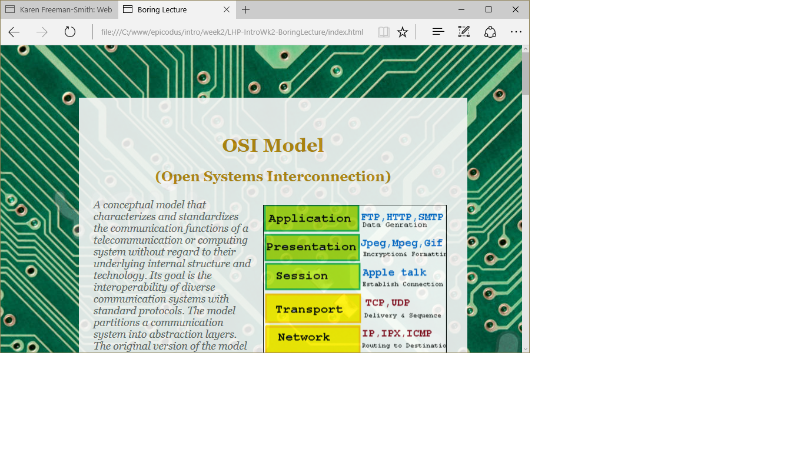

# :sleeping: [Boring Lecture: OSI Model](http://karenfreemansmith.github.io/lecture) :sleeping:

__Version 1: March 29, 2016__

## by [Karen Freeman-Smith](http://karenfreemansmith.github.io)

### Description
__*Basic Webpage*__

Text-dense webpage to practice CSS styles, box model, media queries.

# Boring Lecture (OSI Model)
Version 0.0.2: March 29, 2016
by [Karen Freeman-Smith](https://karenfreemansmith.github.io)

### Technologies Used
HTML, CSS, Bootstrap, JavaScript, jQuery

## Description
*[Learn How To Program](http://learnhowtoprogram.com) Intro to Programming Week 2 Individual Project: Enhance the "boring lecture" from week one by adding highlighting to a paragraph when it is clicked.*

## Setup/Installation
* [View on Github Pages](https://karenfreemansmith.github.io/LHP-IntroWk2-BoringLecture)
* _OR_
* Clone directory
* Open index.html in your favorite browser

## Support & Contact
For questions, concerns, or suggestions please email karenfreemansmith@gmail.com

## Known Issues
* None

## Legal
*Licensed under the GNU General Public License v3.0*

Copyright (c) 2016 Copyright _[Karen Freeman-Smith](https://karenfreemansmith.github.io)_ All Rights Reserved.
